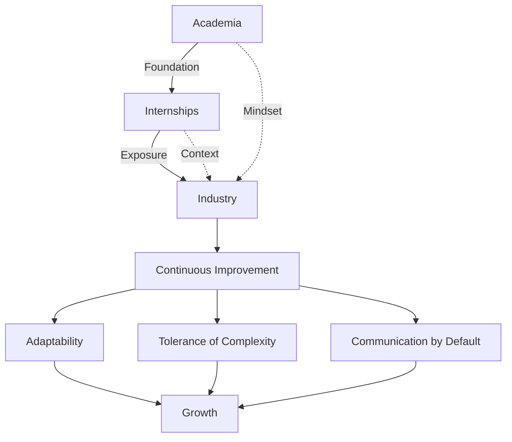

It's been one month since I started my first real industry role. Before this, I spent five years in academia and a series of internships. Three very different environments. Three very different lessons.

Here's what each world taught me — and what didn't transfer.

## Academia: The controlled experiment

Academia is a structured environment. Resources are abundant. Learning happens in a controlled setting where the cost of failure is low and the feedback loop is deliberately slow.

What academia gave me:
- A solid foundation of knowledge and skills
- The ability to self-direct learning across multiple domains
- Comfort with ambiguity in problem statements (even if the solutions were theoretical)

What it didn't prepare me for:
- Technology constraints you can't choose or upgrade
- Resource limitations that aren't hypothetical
- The speed at which real organisations make decisions

## Internships: The viewing platform

Internships gave me a glimpse into industry — a chance to step outside the classroom and observe the professional landscape. But I often felt like I was standing on the edge, not fully immersed.

The thing about internships is they're structured to be safe. You get sandboxed projects, defined scope, and a mentor whose job includes making sure you succeed. This is valuable, but it's not the same as carrying real accountability.

What internships gave me:
- Exposure to real tools and workflows
- Practice communicating with non-academic stakeholders
- Evidence that I could operate outside a classroom

What they didn't give me:
- The weight of a project where failure had real consequences
- The experience of navigating office politics and resource constraints
- The rhythm of sustained delivery over months, not weeks

## Industry: The real work begins

Industry is where constraints are real. Technology choices are often inherited, not chosen. Resources are finite. People disagree about what matters. You build things and sometimes they get reworked the next day because priorities shifted.

The most valuable skill that carried me through all three worlds wasn't Python, wasn't statistics, wasn't any technology I learned in a lab. It was **continuous improvement** — the mindset of treating every day as a chance to get slightly better.

A few truths I've accepted:

1. **Your role won't always align with your preferences.** That's actually an opportunity. The parts of the job you resist often teach you the most.

2. **Change is constant.** Some days, work you've put hours into needs to be completely reworked. This isn't failure — it's iteration. The faster you accept that, the faster you bounce back.

3. **Internships don't equate to industry experience.** They're valuable, but the scale and pressure are genuinely different. Don't be surprised when the first few months feel harder than expected.

4. **Documentation is a superpower.** Writing down what you learn, what decisions were made, and why — this compounds faster than any technical skill I've picked up.

## The skill with no ceiling

Every technical domain has a depth boundary. Python only goes so deep before you're just writing the same patterns faster. Git only gets so complex before you've seen every merge conflict scenario.

Continuous improvement doesn't have a ceiling. Every new problem, every mentee question, every framework rebuilt from first principles — it all compounds.

This is the thread connecting academia, internships, and industry. The environments change. The constraints change. The one thing that always works is approaching each day with curiosity and a willingness to be wrong.

---

*Adapted from a LinkedIn post (February 2025) that received 3,735 impressions. Written after one month at Consumer and Business Services, SA. Originally written by Rin Huang; edited and expanded with Claude Opus (Anthropic) for the rin.contact blog.*
