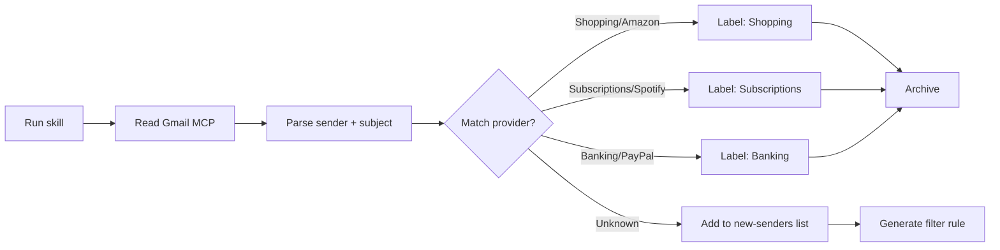

My inbox hit the point where the unread count stopped being a number and started being a shrug. Grocery receipts. Spotify renewals. Bank alerts. Newsletters I signed up for in 2022 and never read. And somewhere in there, the occasional message from a human who genuinely needed a reply.

Manual filters help. But every new sender means another rule. I wanted something I could run on a schedule, with my personal rules staying on my machine — not uploaded to some third-party Gmail plugin that reads my entire inbox.

So I built a Claude Cowork skill that does it instead.

## What it does

The Gmail Labeler Skill is an agent skill for Cursor, Claude Desktop, and Codex that triages Gmail by provider. Here's the workflow:



The key behaviors:

- **Reads sender, subject, and snippet only** — never touches attachment contents
- **Labels by provider** and archives noise (receipts stay searchable, not deleted)
- **First run**: up to 12 months of mail → builds sender rules + an importable `gmail-filters.xml`
- **Weekly afterward**: catches new senders from the last seven days

Nothing is deleted. Your personal rules live in local files that never leave your machine. The repo includes ~100 starter brand rules you can customise.

## Why this matters

This isn't a SaaS product. It's not a Gmail add-on. It's a skill — a prompt + a set of tools that an AI agent can execute on your behalf, on your machine, with your rules.

The architecture is deliberately minimal:

```text
gmail-labeler/
├── rules/           ← ~100 starter brand→provider mappings
├── skill.md         ← the agent prompt
├── output/
│   ├── labels/      ← generated labels per provider
│   └── gmail-filters.xml  ← importable Gmail filter rules
└── README.md
```

The agent reads the rules, connects to Gmail via MCP, and executes the triage. Rules are plain text files you can edit in any editor. No database. No API keys. No cloud.

## A note on inbox safety

⚠️ Before you try anything like this: please limit what your AI agent can access if your inbox holds confidential information. This skill reads sender, subject, and snippets only — not attachment contents — and never deletes mail. Even so, treat inbox automation like any other tool that touches sensitive data.

## What I learned building this

Claude Cowork makes it possible to build things that would have been weekend projects into afternoon projects. The Gmail MCP server provides a clean integration point. The skill architecture — prompt + tools + rules — is composable: you can swap out the provider list, add custom labeling logic, or adapt the same pattern for other structured inbox tasks.

The repo is open-source at [github.com/rNLKJA/gmail-labeler](https://github.com/rNLKJA/gmail-labeler). Fork it, adapt it, or use it as a reference for building your own agent skills.

---

*Project built with Claude Opus (Anthropic) via Cursor. Open-source under MIT. Originally posted on LinkedIn (May 2026). Written by Rin Huang; edited and expanded with Claude Opus for the rin.contact blog.*
