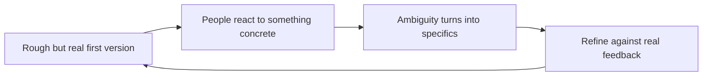

The hardest work I have done was not technically the hardest. It was the work where nothing existed yet. No data pipeline, no agreed definitions, no template to copy, and no one who could tell me what good looked like because it had not been built before. Just a real problem, a handful of competing priorities, and the expectation that I would turn it into something useful.

That was the shape of building an intelligence capability from scratch inside a government compliance team. The instinct in that situation is to wait until you understand everything before you commit to anything. I learned that the instinct is wrong.

## Why waiting feels safe and is not

When a problem is ambiguous, planning feels like progress. You map the data sources, you interview stakeholders, you draw the ideal architecture. It is comfortable because nothing you produce can be wrong yet. Nothing is real enough to criticise.

The trouble is that ambiguity does not resolve from thinking about it. It resolves from contact. You do not actually know whether a definition works until someone tries to use it and tells you it does not. You do not know which data source is trustworthy until you put a number from it in front of the person who knows the domain and watch them frown. A plan held in your head is a plan that has never been tested.

So the long planning phase is not the careful option. It is the slow one, and it hides the fact that you are still guessing.

## Make something concrete, fast

The single most useful thing I learned is to generate something workable quickly, even when it is imperfect, so that people have something concrete to react to.

A rough first version does something a perfect plan cannot: it gives everyone a shared object to point at. Stakeholders who could not describe what they wanted in the abstract become very clear the moment they see a draft that is not quite right. The wrong number on a real dashboard gets corrected within the hour. The missing category gets named. Ambiguity collapses into specifics the instant there is something real on the table.

This is not an argument for shipping sloppy work. It is an argument about sequence. You earn the right to refine by first making something that exists. Momentum matters more than polish when clarity is low, because momentum is what produces the information you are missing.

## Build the boring infrastructure early

There is a tension here worth naming. Moving fast on the output does not mean skipping the foundations. The opposite, in fact.

When you are establishing a capability rather than running an existing one, the durable value is rarely the first analysis. It is the standard procedure, the validation step, and the single agreed source of truth that means the next person gets a trustworthy answer without you in the room. I learned to build those in parallel with the visible work, not after it. The dashboard people see is the part that earns attention. The quiet harmonisation, the documented definitions, and the validation checks underneath are the part that makes it last.

Skip that, and you get a capability that works exactly once, on your laptop, while you are watching it.

## What it actually takes

Working without a playbook is less about brilliance and more about temperament. It rewards a particular set of habits: a tolerance for being visibly wrong early, a bias towards making the abstract concrete, and the discipline to lay foundations while everything around them is still uncertain.

It is also where the most growth is. A well-defined problem teaches you a technique. An undefined one teaches you how to think, because you have to decide what the problem even is before you can solve it. I keep choosing that kind of work on purpose, because the alternative, only ever solving problems someone else has already framed, has a ceiling.

If I had to compress it into one line: when the path is unclear, do not wait for it to clear. Build the smallest real thing you can, put it in front of someone, and let their reaction draw the map.
