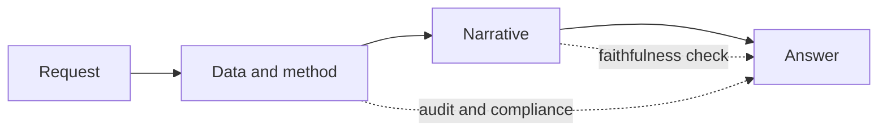

Most organisations treat AI governance as a document. Someone writes a policy, a risk assessment gets filled in, a model card is filed, and the folder sits on a shared drive until an audit or an incident forces someone to open it again. The work is real, but it happens beside the system rather than inside it. By the time anyone reads the document, the model has answered thousands of questions, and there is no way to tie any single one of those answers back to the controls the document describes.

I came at this from the other direction. The work I do sits in government, where a wrong number in a briefing is not an embarrassment, it is a decision made on a false premise. When I started building AI-assisted analysis tools, the question that would not leave me alone was not "is the model good." It was "when this thing produces an answer that ends up in front of a decision-maker, can I prove how it got there." A policy document cannot answer that. Only the system can.

## What "on the request path" means

The request path is the sequence a question travels through to become an answer. A user asks something, data is pulled, a method runs, a narrative is generated, and a result comes back. Governance on the request path means the controls live inside that sequence rather than in a separate document. Every answer the system gives produces its own evidence as a side effect of being produced.

Concretely, in the product I have been building, three things ride along with every response.

The first is a tamper-evident audit log. Each request writes a record that is hash-chained to the one before it, so the history cannot be quietly edited after the fact. If someone asks later how a particular figure was produced, the answer is not "let me check the policy", it is "here is the exact request, the data version, the method that ran, and a chain that proves the record has not been altered since."

The second is the compliance artefact, generated rather than written. Frameworks like the Australian government's digital and data standards and the EU AI Act ask for specific evidence about how an automated system is used. Instead of maintaining that evidence by hand and watching it drift out of date, the system emits it from what actually happened on each request. The document describes reality because it is built from reality.

The third is a faithfulness check on anything a language model writes. When a model turns numbers into a sentence, the risk is not that the prose reads badly, it is that the prose quietly says something the numbers do not support. So the narrative is checked against the underlying figures before it is allowed through, and a claim the data does not back is caught at the source instead of in a reading pack.

## Why government raises the stakes

Plenty of settings can tolerate an occasional confident-but-wrong answer. A product recommendation that misses is a minor annoyance. A public-sector analysis that misses can shape an eligibility rule, a resourcing decision, or a public statement, and the people affected usually had no say in the model being used at all.

That asymmetry is the whole argument. When the cost of being wrong lands on someone who did not choose the system, the burden of proof has to sit with the system, not with the person harmed by it. Governance on the request path is what moves that burden to where it belongs. It does not make the model more accurate. It makes the model accountable, which is a different property, and for public work the more important one.

## The objection, and the answer

The reasonable objection is that all of this sounds slow. Hash chains, generated artefacts, a faithfulness check on every response. Surely that is friction stacked on friction.

It would be, if it were bolted on afterwards. The reason it is not is that the evidence is a by-product of work the system already does. The request is already being handled, so writing a chained record of it is cheap. The method is already being chosen, so recording which one ran is nearly free. The narrative is already being generated, so checking it against the figures is one more step in the same pipeline, not a separate review weeks later. The expensive version of governance is the one where a person reconstructs after the fact what the system could have recorded in the moment. Doing it on the request path is the cheap version, not the costly one.

## Governance as a property, not a gate

The shift I keep coming back to is from governance as a gate to governance as a property. A gate is a checkpoint you pass once: a sign-off, a filed document, a box ticked at the start. A property is something true of the system continuously, the way a building is load-bearing the whole time it stands and not only on the day it was inspected.

AI in public decision-making needs the second kind. Not a folder that proves the system was responsible on the day it launched, but a system that produces the proof of its own responsibility every time it is used. Put the governance on the request path, and the evidence is always there, because it was never kept somewhere else.

---

*The product described here is Signal, an open-source reference implementation that applies this approach to public crime statistics. See the [case study](/projects/signal) for the build, or the [code on GitHub](https://github.com/rNLKJA/signal).*
