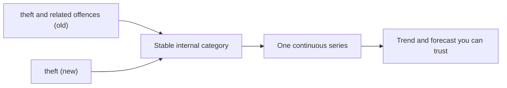

Most write-ups of data work skip the part that takes the most time. They show the model, the chart, the clean final number. What they leave out is the unglamorous stretch in the middle, where you discover that the data does not mean what you assumed it meant, and you have to fix that before anything downstream is worth trusting.

I ran into a clear example while building Signal, a small product that analyses public crime statistics. The plan was simple: take an offence category, look at how it has trended over the last few years, and say whether the movement is real. Easy, until the categories moved.

## A trend that quietly broke in half

Partway through the period I was analysing, South Australia Police changed how they classified offences. What had been recorded as "theft and related offences" became, after the change, simply "theft". To a person reading a report, those are obviously the same thing. To a script grouping rows by an exact string, they are two completely different categories.

The effect is subtle and dangerous. If you trend "theft" naively, the series looks like it appears from nowhere on the changeover date, while the older "theft and related offences" series looks like it falls off a cliff. Neither drop is real. Nothing changed on the ground. Only the label changed. But a forecast built on either half would confidently describe a trend that is an artefact of the recording system, not of the world.

This is the kind of error that does not announce itself. The code runs, the chart renders, the number looks plausible. You only catch it if you go looking for it, which means you only catch it if you already suspect that the categories are not as stable as they pretend to be.

## The fix is a small, boring layer

Handling it was not clever. It was a harmonisation layer: a small piece of code that maps both the old and the new vocabularies onto one stable internal scheme, so that a row recorded under either label lands in the same place.

The same mapping has to apply everywhere the data enters, to the live feed and to any stored snapshot, or you reintroduce the split you just removed. It is perhaps thirty lines. It will never be the part of the project anyone asks about. And it is the part that decides whether every chart above it is honest.

## Why this is most of the actual job

I have come to think that this quiet taxonomy work is most of what real public-sector data engineering actually is. The modelling is often the small part. The large part is reconciling systems that were never designed to agree: a field that meant one thing until a policy update, a category that two agencies define differently, a date that is recorded in local time in one table and UTC in another, an identifier that was reused after someone left.

None of that is visible in the final dashboard, which is exactly why it is so easy to skip and so expensive to skip. A model trained on un-harmonised data is not a slightly worse model. It is a confident answer to a question you did not actually ask, because the rows you fed it were not the things you thought they were.

## What it changes about how I work

Two habits came out of this. The first is to treat every category and every definition as something that can change over time, and to check whether it did, before trusting any trend that crosses a boundary. The second is to build the harmonisation as a named, documented layer rather than a quiet fix buried in a notebook, so the next person can see the assumption and challenge it.

It is not the work that gets you hired in an interview, where everyone wants to talk about models. But it is the work that means the answer you hand to someone making a real decision is one they can actually rely on. The model is the part you show. The taxonomy is the part that makes it true.
